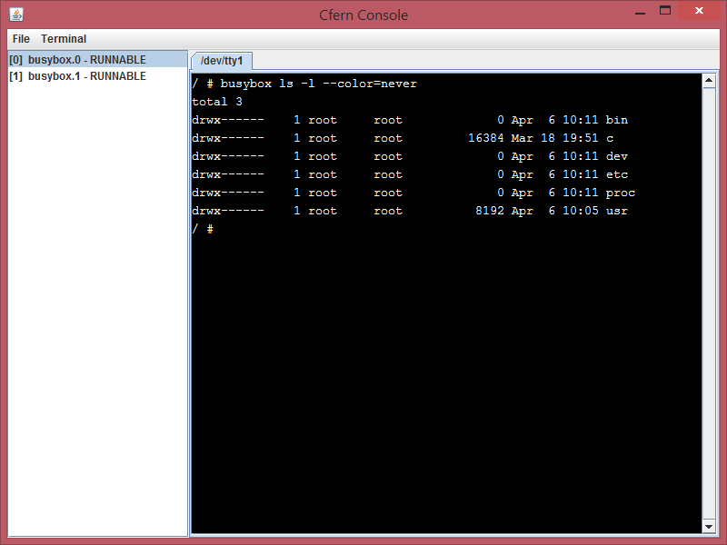

Cfern
=

A MIPS/Linux/ELF emulator written in Java, 2005

This project is historical and is not particularly functional

Cfern requires a mips cross compiler to create mips binaries, 
such as GCC, plus a cross compiled glibc, neither of which are
particularly straightforward to create. For a starting binary,
you can get a statically built busybox without symbols from

http://busybox.net/downloads/binaries/1.16.0/

and put it in the sbin directory

Screenshot
-

Download
-

[Runnable jar file](https://www.dropbox.com/s/i4qvprecei96a1e/cfern.jar?dl=0)
